# Markdown 实用教程

> 从基础语法到高级用法，一篇掌握 Markdown 所有核心功能

---

## 目录

- [一、什么是 Markdown？](#一什么是-markdown)
- [二、基础语法](#二基础语法)
- [三、进阶语法](#三进阶语法)
- [四、高级用法](#四高级用法)
  - [4.1 表格](#41-表格)
  - [4.2 流程图](#42-流程图)
  - [4.3 时序图](#43-时序图)
  - [4.4 类图](#44-类图)
  - [4.5 状态图](#45-状态图)
  - [4.6 饼图](#46-饼图)
  - [4.7 思维导图 / 树状图](#47-思维导图--树状图)
  - [4.8 甘特图](#48-甘特图)
  - [4.9 Git 提交分支图](#49-git-提交分支图)
- [五、KaTeX 数学公式](#五katex-数学公式)
  - [5.1 行内公式](#51-行内公式)
  - [5.2 行间公式](#52-行间公式)
  - [5.3 常用数学符号](#53-常用数学符号)
  - [5.4 矩阵](#54-矩阵)
  - [5.5 多行公式](#55-多行公式)
- [六、Markdown 中常用的 HTML 标签](#六markdown-中常用的-html-标签)
  - [6.1 块级元素](#61-块级元素)
  - [6.2 行内元素](#62-行内元素)
  - [6.3 高级布局技巧](#63-高级布局技巧)
- [七、最佳实践与常见问题](#七最佳实践与常见问题)

---

## 一、什么是 Markdown？

**Markdown** 是一种轻量级标记语言，由 **John Gruber** 于 2004 年创建。它使用纯文本格式编写，通过简单的符号标记实现文档排版，最终可转换为 HTML 或其他格式。

**核心特点：**

- ✅ **易读易写** —— 纯文本格式，学习成本极低
- ✅ **平台无关** —— 几乎所有代码平台（GitHub、GitLab、Notion 等）都支持
- ✅ **扩展性强** —— 可嵌入 HTML、LaTeX、Mermaid 等
- ✅ **版本友好** —— 适合 Git 等版本控制系统追踪差异

---

## 二、基础语法

### 2.1 标题

使用 `#` 表示标题，一个 `#` 为一级标题，最多支持六级：

```markdown
# 一级标题
## 二级标题
### 三级标题
#### 四级标题
##### 五级标题
###### 六级标题
```

### 2.2 段落与换行

- 段落之间用**空行**分隔
- 行尾加 **两个空格** 再回车可实现行内换行（`<br>`）

```markdown
这是第一段落。

这是第二段落。
这是同一段落的另一行（无空行）。
这是行尾加两个空格后的换行→··
新的一行
```

### 2.3 强调

```markdown
*斜体* 或 _斜体_
**粗体** 或 __粗体__
***粗斜体*** 或 ___粗斜体___
~~删除线~~
==高亮==（部分平台支持）
<u>下划线</u>（需用 HTML 标签）
```

效果：*斜体*、**粗体**、***粗斜体***、~~删除线~~

### 2.4 列表

**无序列表**：使用 `-`、`*` 或 `+`

```markdown
- 苹果
- 香蕉
  - 泰国香蕉（嵌套缩进 2 或 4 空格）
- 樱桃
```

**有序列表**：使用 `数字.`

```markdown
1. 第一步
2. 第二步
   1. 第二步的子步骤（缩进）
3. 第三步
```

**任务列表**（Task List）：

```markdown
- [x] 已完成任务
- [ ] 未完成任务
- [ ] 待办事项
```

### 2.5 链接

```markdown
行内链接：[显示文本](https://example.com)
带标题的链接：[显示文本](https://example.com "悬停提示文本")
自动链接：<https://example.com>
邮箱链接：<user@example.com>
引用式链接：[显示文本][引用ID]

[引用ID]: https://example.com
```

### 2.6 图片

```markdown
行内图片：
带标题的图片：
引用式图片：![替代文本][图片引用ID]

[图片引用ID]: https://example.com/image.png
```

**技巧**：用 `` 可控制图片尺寸（部分平台支持）。

### 2.7 代码

**行内代码**：用反引号包裹

```markdown
在行文中使用 `console.log()` 表示代码。
```

**代码块**：用三个反引号包裹，可指定语言实现语法高亮

````markdown
```python
def hello():
    print("Hello, Markdown!")
```
````

支持的语言：`javascript`、`python`、`java`、`go`、`rust`、`bash`、`json`、`yaml`、`sql` 等。

### 2.8 引用

使用 `>` 表示引用，可嵌套：

```markdown
> 这是一级引用
>
> > 这是二级引用（嵌套）
>
> 回到一级引用
```

### 2.9 分隔线

三个或以上的 `-`、`*` 或 `_`：

```markdown
---
***
___
```

### 2.10 转义字符

使用反斜杠 `\` 转义 Markdown 特殊字符：

```markdown
\* 这不是斜体 \*
\` 这不是代码 \`
```

---

## 三、进阶语法

### 3.1 脚注

```markdown
这是一个带脚注的句子[^1]。

[^1]: 这是脚注的内容，通常会显示在页面底部。
```

### 3.2 目录（TOC）

部分平台支持自动生成目录：

```markdown
[TOC]
```

或使用 `[toc]`。在不支持自动目录的平台，可手动用链接构建目录。

### 3.3 上标与下标

```markdown
上标：X^2^（某些平台）
下标：H~2~O（某些平台）

通用方案（HTML）：
X<sup>2</sup>
H<sub>2</sub>O
```

### 3.4 定义列表

```markdown
Markdown
:   一种轻量级标记语言

HTML
:   超文本标记语言
:   用于构建网页结构
```

### 3.5 折叠 / 详情块（GitHub Flavored）

```markdown
<details>
<summary>点击展开查看详情</summary>

这里是被折叠的内容，支持 Markdown 语法。

- 列表项 1
- 列表项 2

</details>
```

<details>
<summary>点击展开查看详情</summary>

这里是被折叠的内容，支持 Markdown 语法。

- 列表项 1
- 列表项 2

</details>

### 3.6 警告框 / 提示块（部分平台）

某些平台（如 GitHub）支持以下语法：

```markdown
> [!NOTE]
> 这是一条普通提示。

> [!TIP]
> 这是一条实用建议。

> [!IMPORTANT]
> 这是一条关键信息。

> [!WARNING]
> 这是一条警告信息。

> [!CAUTION]
> 这是一条谨慎提醒。
```

---

## 四、高级用法

### 4.1 表格

使用 `|` 分隔列，`-` 分隔表头与内容：

```markdown
| 左对齐 | 居中对齐 | 右对齐 |
| :----- | :------: | -----: |
| 单元格 | 单元格   | 单元格 |
| 单元格 | 单元格   | 单元格 |
```

**对齐方式：**

| 写法      | 说明     |
| :-------- | :------- |
| `:---`  | 左对齐   |
| `:---:` | 居中对齐 |
| `---:`  | 右对齐   |

**复杂表格示例：**

```markdown
| 姓名   | 年龄 | 城市   | 职业     | 爱好         |
| :----- | :--: | :----- | :------- | :----------- |
| 张三   | 25   | 北京   | 工程师   | 游泳、阅读   |
| 李四   | 30   | 上海   | 设计师   | 摄影、旅行   |
| 王五   | 28   | 深圳   | 产品经理 | 篮球、游戏   |
```

| 姓名 | 年龄 | 城市 | 职业     | 爱好       |
| :--- | :--: | :--- | :------- | :--------- |
| 张三 |  25  | 北京 | 工程师   | 游泳、阅读 |
| 李四 |  30  | 上海 | 设计师   | 摄影、旅行 |
| 王五 |  28  | 深圳 | 产品经理 | 篮球、游戏 |

**表格内换行**：用 `<br>` 标签

```markdown
| 属性 | 说明 |
| :--- | :--- |
| name | 姓名<br>必填，最长 50 字符 |
| age  | 年龄<br>可选，整数 |
```

### 4.2 流程图

使用 **Mermaid** 语法绘制流程图。Mermaid 是一种基于文本的图表描述语言，被 GitHub、GitLab 等广泛支持。

#### 基本流程图

````markdown
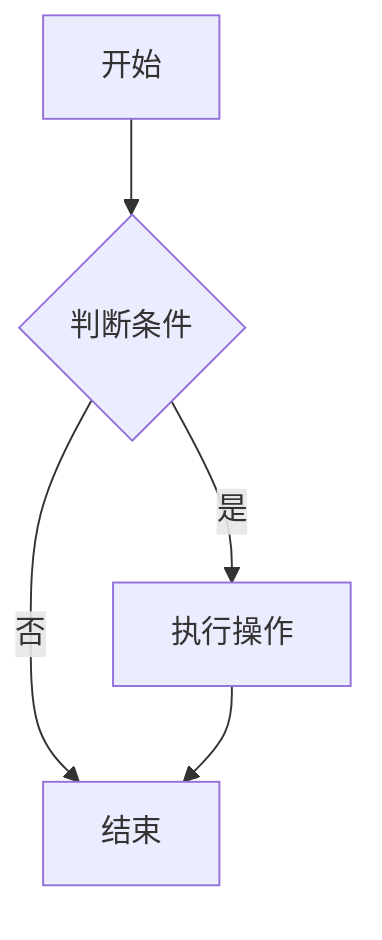
````


**节点形状说明：**

| 写法            | 形状               | 示例              |
| :-------------- | :----------------- | :---------------- |
| `A[文本]`     | 矩形（默认）       | `A[普通节点]`   |
| `A(文本)`     | 圆角矩形           | `A(开始/结束)`  |
| `A([文本])`   | 圆角矩形（另一种） | `A([圆角节点])` |
| `A[[文本]]`   | 带边框矩形         | `A[[子程序]]`   |
| `A[(文本)]`   | 圆柱（数据库）     | `A[(数据库)]`   |
| `A{文本}`     | 菱形（判断）       | `A{条件判断}`   |
| `A>文本]`     | 旗帜形             | `A>输出结果]`   |
| `A===文本===` | 六边形             | `A===六边形===` |
| `A((文本))`   | 圆形               | `A((开始))`     |

**连线样式：**

| 写法                | 说明         |
| :------------------ | :----------- |
| `A --> B`         | 有向箭头     |
| `A --- B`         | 无箭头连线   |
| `A -.-> B`        | 虚线箭头     |
| `A ==> B`         | 粗线箭头     |
| `A -- 文本 --> B` | 带标签的箭头 |
| `A -->              | 文本         |

#### 子图（Subgraph）

````markdown
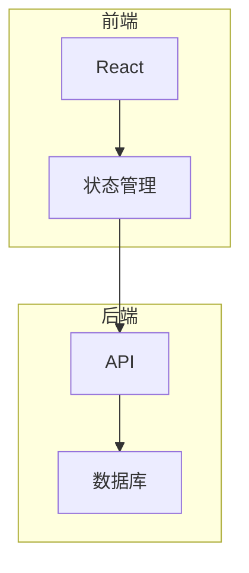
````


#### 横向流程图


### 4.3 时序图

````markdown
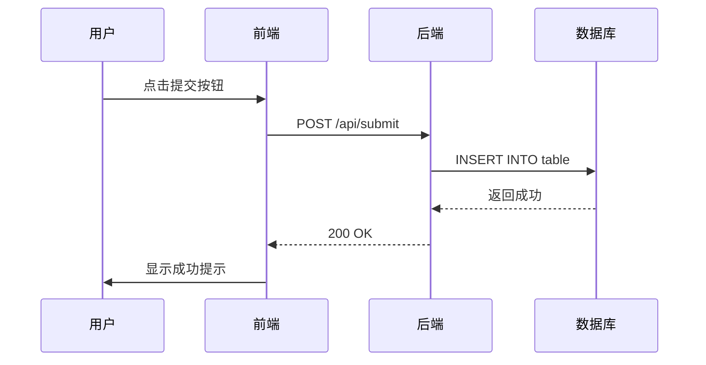
````


**连线类型：**

| 写法     | 说明                      |
| :------- | :------------------------ |
| `->>`  | 实线箭头（同步消息）      |
| `-->>` | 虚线箭头（异步/返回消息） |
| `->`   | 实线无箭头                |
| `-->`  | 虚线无箭头                |
| `-x`   | 实线带 X                  |
| `--x`  | 虚线带 X                  |

**激活框（Activation）：**

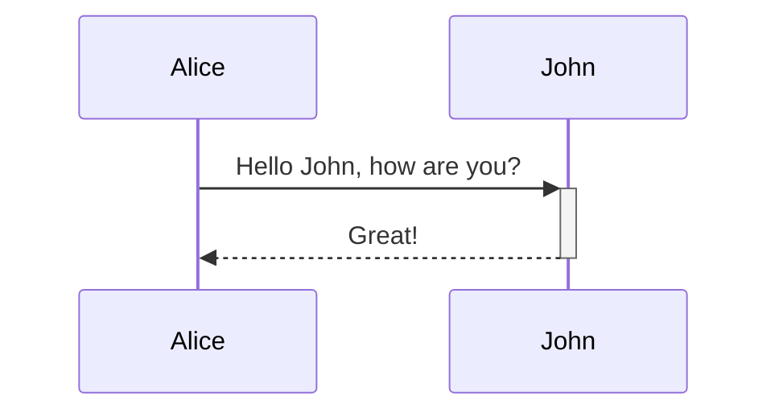

`+` 激活生命线，`-` 停用生命线。

### 4.4 类图

````markdown
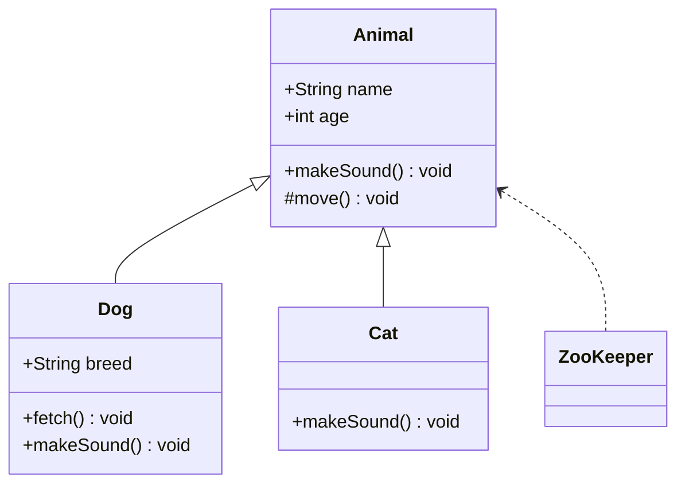
````


**可见性修饰符：**

| 符号 | 含义                |
| :---: | :------------------ |
| `+` | public（公有）      |
| `-` | private（私有）     |
| `#` | protected（受保护） |
| `~` | package（包内可见） |

**关系类型：**

| 写法     | 含义         |
| :------- | :----------- |
| `<\|--` | 继承（泛化） |
| `*--`  | 组合         |
| `o--`  | 聚合         |
| `-->`  | 关联         |
| `..>`  | 依赖         |
| `..\|>` | 实现         |

### 4.5 状态图

````markdown
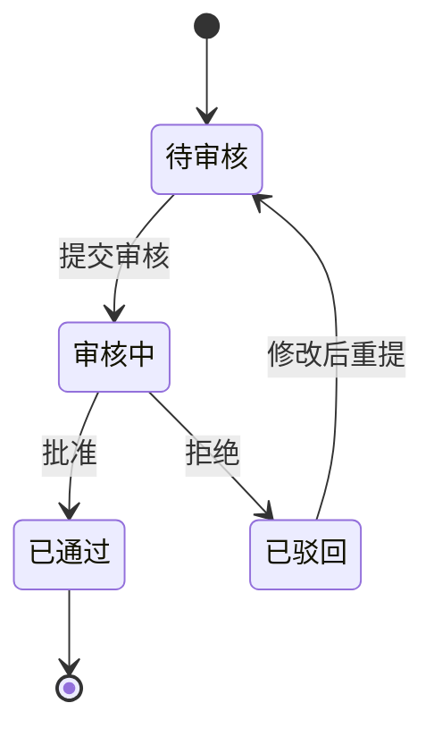
````


### 4.6 饼图

````markdown
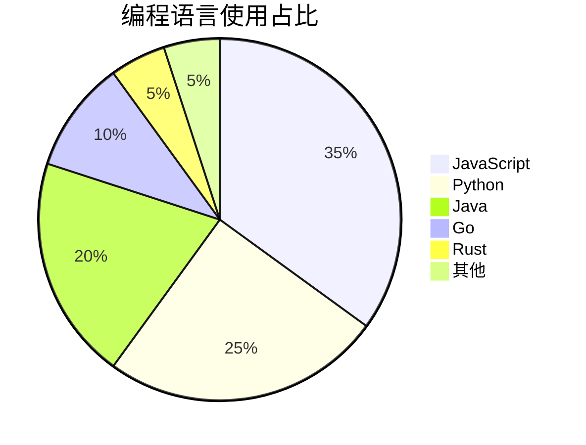
````


### 4.7 思维导图 / 树状图

Mermaid 目前没有原生思维导图语法，但我们可以用 **graph 流程图** 模拟树状结构：

````markdown
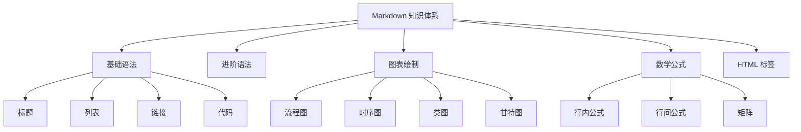
````


### 4.8 甘特图

````markdown
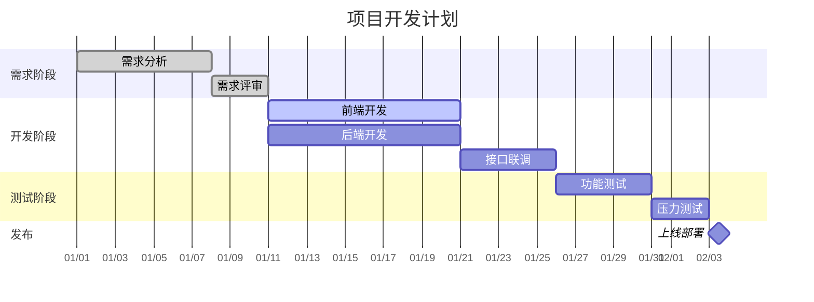
````


**任务状态：**

| 标记             | 含义                 |
| :--------------- | :------------------- |
| `done`         | 已完成（灰色）       |
| `active`       | 进行中（蓝色）       |
| 无标记           | 待开始（白色）       |
| `crit`         | 关键路径（红色边框） |
| `milestone`    | 里程碑（菱形）       |
| `after 任务ID` | 指定依赖关系         |

### 4.9 Git 提交分支图

````markdown
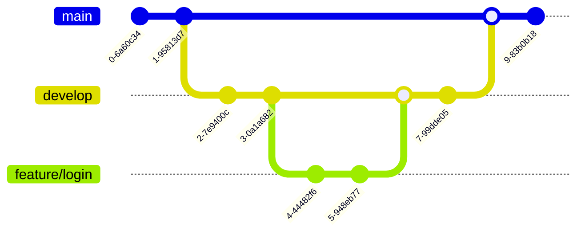
````

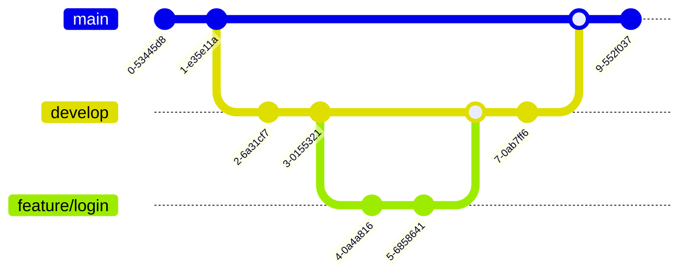

---

## 五、KaTeX 数学公式

**KaTeX** 是一个快速渲染 LaTeX 数学公式的 JavaScript 库。在支持 KaTeX 的平台上（如 Typora、某些 Markdown 编辑器），可以用 `$` 符号编写公式。

### 5.1 行内公式

用单个 `$` 包裹：

```markdown
爱因斯坦质能方程：$E = mc^2$

勾股定理：$a^2 + b^2 = c^2$

欧拉公式：$e^{i\pi} + 1 = 0$
```

效果：爱因斯坦质能方程：$E = mc^2$

### 5.2 行间公式

用两个 `$$` 包裹，公式居中显示：

```markdown
$$
\int_{a}^{b} f(x) \, dx = F(b) - F(a)
$$
```

效果：

$$
\int_{a}^{b} f(x) \, dx = F(b) - F(a)
$$

更多示例：

```markdown
$$
\lim_{x \to \infty} \frac{1}{x} = 0
$$
```

$$
\lim_{x \to \infty} \frac{1}{x} = 0
$$

```markdown
$$
\sum_{k=1}^{n} k = \frac{n(n+1)}{2}
$$
```

$$
\sum_{k=1}^{n} k = \frac{n(n+1)}{2}
$$

### 5.3 常用数学符号

| 类别               | 符号                                   | KaTeX 写法                                     |
| :----------------- | :------------------------------------- | :--------------------------------------------- |
| **希腊字母** | $\alpha, \beta, \gamma$              | `\alpha`, `\beta`, `\gamma`              |
|                    | $\Delta, \Sigma, \Omega$             | `\Delta`, `\Sigma`, `\Omega`             |
| **运算符**   | $\times, \div, \pm, \mp$             | `\times`, `\div`, `\pm`, `\mp`         |
|                    | $\cdot, \circ, \ast$                 | `\cdot`, `\circ`, `\ast`                 |
|                    | $\sqrt{x}, \sqrt[3]{x}$              | `\sqrt{x}`, `\sqrt[3]{x}`                  |
|                    | $\frac{a}{b}$                        | `\frac{a}{b}`                                |
| **关系符**   | $\leq, \geq, \neq, \approx$          | `\leq`, `\geq`, `\neq`, `\approx`      |
|                    | $\subset, \supset, \subseteq$        | `\subset`, `\supset`, `\subseteq`        |
|                    | $\in, \notin, \ni$                   | `\in`, `\notin`, `\ni`                   |
|                    | $\parallel, \perp, \cong$            | `\parallel`, `\perp`, `\cong`            |
| **集合**     | $\cap, \cup, \emptyset$              | `\cap`, `\cup`, `\emptyset`              |
|                    | $\mathbb{N}, \mathbb{Z}, \mathbb{R}$ | `\mathbb{N}`, `\mathbb{Z}`, `\mathbb{R}` |
| **箭头**     | $\to, \rightarrow, \leftarrow$       | `\to`, `\rightarrow`, `\leftarrow`       |
|                    | $\Rightarrow, \Leftrightarrow$       | `\Rightarrow`, `\Leftrightarrow`           |
|                    | $\mapsto, \longmapsto$               | `\mapsto`, `\longmapsto`                   |
| **微积分**   | $\int, \iint, \iiint$                | `\int`, `\iint`, `\iiint`                |
|                    | $\oint$                              | `\oint`                                      |
|                    | $\partial, \nabla$                   | `\partial`, `\nabla`                       |
|                    | $\infty$                             | `\infty`                                     |
| **括号**     | $\left( \frac{a}{b} \right)$         | `\left( \frac{a}{b} \right)`                 |
|                    | $\{x \mid x > 0\}$                   | `\{x \mid x > 0\}`                           |
| **上下标**   | $x^2, x^{a+b}$                       | `x^2`, `x^{a+b}`                           |
|                    | $x_n, x_{ij}$                        | `x_n`, `x_{ij}`                            |
|                    | $\hat{x}, \bar{x}, \tilde{x}$        | `\hat{x}`, `\bar{x}`, `\tilde{x}`        |
|                    | $\vec{v}, \dot{x}, \ddot{x}$         | `\vec{v}`, `\dot{x}`, `\ddot{x}`         |
| **三角函数** | $\sin, \cos, \tan, \cot$             | `\sin`, `\cos`, `\tan`, `\cot`         |
|                    | $\arcsin, \arccos$                   | `\arcsin`, `\arccos`                       |
| **对数**     | $\log, \ln, \lg$                     | `\log`, `\ln`, `\lg`                     |

### 5.4 矩阵

```markdown
$$
\begin{matrix}
1 & 2 & 3 \\
4 & 5 & 6 \\
7 & 8 & 9
\end{matrix}
$$
```

$$
\begin{matrix}
1 & 2 & 3 \\
4 & 5 & 6 \\
7 & 8 & 9
\end{matrix}
$$

**带括号的矩阵：**

```markdown
$$
\begin{pmatrix}
a_{11} & a_{12} & a_{13} \\
a_{21} & a_{22} & a_{23} \\
a_{31} & a_{32} & a_{33}
\end{pmatrix}
$$
```

$$
\begin{pmatrix}
a_{11} & a_{12} & a_{13} \\
a_{21} & a_{22} & a_{23} \\
a_{31} & a_{32} & a_{33}
\end{pmatrix}
$$

**其他矩阵类型：**

| 环境        | 括号           | 示例                                     |
| :---------- | :------------- | :--------------------------------------- |
| `matrix`  | 无             | $\begin{matrix}1&2\\3&4\end{matrix}$   |
| `pmatrix` | 圆括号`()`   | $\begin{pmatrix}1&2\\3&4\end{pmatrix}$ |
| `bmatrix` | 方括号`[]`   | $\begin{bmatrix}1&2\\3&4\end{bmatrix}$ |
| `Bmatrix` | 花括号`\{\}` | $\begin{Bmatrix}1&2\\3&4\end{Bmatrix}$ |
| `vmatrix` | 竖线`\|\|`     | $\begin{vmatrix}1&2\\3&4\end{vmatrix}$ |
| `Vmatrix` | 双竖线`\|\|\|\|` | $\begin{Vmatrix}1&2\\3&4\end{Vmatrix}$ |

**行列式示例：**

```markdown
$$
\det(A) = \begin{vmatrix}
a & b \\
c & d
\end{vmatrix} = ad - bc
$$
```

$$
\det(A) = \begin{vmatrix}
a & b \\
c & d
\end{vmatrix} = ad - bc
$$

### 5.5 多行公式

**方程组：**

```markdown
$$
\begin{cases}
x + y + z = 10 \\
2x - y + z = 5 \\
x + 3y - 2z = 4
\end{cases}
$$
```

$$
\begin{cases}
x + y + z = 10 \\
2x - y + z = 5 \\
x + 3y - 2z = 4
\end{cases}
$$

**对齐公式：**

```markdown
$$
\begin{aligned}
(a + b)^2 &= a^2 + 2ab + b^2 \\
(a - b)^2 &= a^2 - 2ab + b^2 \\
a^2 - b^2 &= (a + b)(a - b)
\end{aligned}
$$
```

$$
\begin{aligned}
(a + b)^2 &= a^2 + 2ab + b^2 \\
(a - b)^2 &= a^2 - 2ab + b^2 \\
a^2 - b^2 &= (a + b)(a - b)
\end{aligned}
$$

**分段函数：**

```markdown
$$
f(x) =
\begin{cases}
x^2, & \text{if } x \geq 0 \\
-x,  & \text{if } x < 0
\end{cases}
$$
```

$$
f(x) =
\begin{cases}
x^2, & \text{if } x \geq 0 \\
-x,  & \text{if } x < 0
\end{cases}
$$

---

## 六、Markdown 中常用的 HTML 标签

由于 Markdown 是纯文本格式，某些排版需求无法原生满足，此时可以直接嵌入 HTML 标签。几乎所有 Markdown 渲染器都支持内嵌 HTML。

### 6.1 块级元素

#### `<div>` —— 通用容器

```markdown
<div align="center">
  <h2>居中标题</h2>
  <p>这是一段居中的文字。</p>
</div>
```

<div align="center">
  <h2>居中标题</h2>
  <p>这是一段居中的文字。</p>
</div>

#### `<details>` / `<summary>` —— 可折叠块

```markdown
<details>
  <summary><b>点击展开查看详情</b></summary>

  这里的内容默认被隐藏。

  - 支持 Markdown 语法
  - 也支持代码块

  ```python
  print("Hello from inside details!")
```

</details>
```

#### `<table>` —— 复杂表格

当 Markdown 原生表格无法满足时，可使用 HTML 表格：

```markdown
<table>
  <tr>
    <th colspan="2">合并列标题</th>
    <th>列三</th>
  </tr>
  <tr>
    <td rowspan="2">合并行</td>
    <td>数据 A</td>
    <td>数据 B</td>
  </tr>
  <tr>
    <td>数据 C</td>
    <td>数据 D</td>
  </tr>
</table>
```

<table>
  <tr>
    <th colspan="2">合并列标题</th>
    <th>列三</th>
  </tr>
  <tr>
    <td rowspan="2">合并行</td>
    <td>数据 A</td>
    <td>数据 B</td>
  </tr>
  <tr>
    <td>数据 C</td>
    <td>数据 D</td>
  </tr>
</table>

#### `<pre>` —— 预格式化文本

```markdown
<pre>
  __      __   _______ 
  \ \    / /  |   __  |
   \ \  / /   |  |__| |
    \ \/ /    |   __  |
     \__/     |__|  |_|
</pre>
```

### 6.2 行内元素

#### `<span>` —— 行内样式容器

```markdown
<span style="color: red; font-weight: bold;">红色粗体文字</span>
<span style="background: yellow;">黄色背景高亮</span>
<span style="font-size: 1.5em;">大号文字</span>
```

#### `<font>` —— 字体控制（已废弃但仍广泛支持）

```markdown
<font color="blue">蓝色文字</font>
<font size="4">四号字体</font>
<font face="宋体">宋体文字</font>
```

> **注意**：`<font>` 标签在 HTML5 中已废弃，建议用 `<span style="...">` 代替。

#### 文本格式标签

| 标签                    | 效果                                    | 用途                 |
| :---------------------- | :-------------------------------------- | :------------------- |
| `<b>` 或 `<strong>` | **粗体**                          | 加粗强调             |
| `<i>` 或 `<em>`     | *斜体*                                | 斜体强调             |
| `<u>`                 | <u>下划线</u>                           | 下划线               |
| `<s>` 或 `<del>`    | <s>删除线</s>                           | 标记删除             |
| `<mark>`              | <mark>高亮</mark>                       | 高亮标记             |
| `<ins>`               | <ins>插入</ins>                         | 插入文本             |
| `<small>`             | <small>小号文字</small>                 | 缩小字号             |
| `<sup>`               | 上标<sup>TM</sup>                       | 上标                 |
| `<sub>`               | 下标<sub>2</sub>                        | 下标                 |
| `<code>`              | `行内代码`                            | 等宽字体             |
| `<kbd>`               | <kbd>Ctrl</kbd> + <kbd>C</kbd>          | 键盘按键             |
| `<abbr>`              | <abbr title="World Wide Web">WWW</abbr> | 缩写（悬停显示全称） |
| `<cite>`              | <cite>引用作品名</cite>                 | 作品标题引用         |

#### 链接与图片增强

```markdown
<!-- 带 target 的链接，在新窗口打开 -->
<a href="https://example.com" target="_blank" rel="noopener">新窗口打开链接</a>

<!-- 带尺寸的图片 -->


<!-- 带样式的图片 -->

```

#### 列表增强

```markdown
<!-- 自定义列表类型 -->
<ol type="A">
  <li>选项 A</li>
  <li>选项 B</li>
  <li>选项 C</li>
</ol>

<ol type="I">
  <li>罗马数字 I</li>
  <li>罗马数字 II</li>
</ol>

<ul style="list-style-type: square;">
  <li>方块标记</li>
  <li>方块标记</li>
</ul>
```

<ol type="A">
  <li>选项 A</li>
  <li>选项 B</li>
  <li>选项 C</li>
</ol>

### 6.3 高级布局技巧

#### 多列布局（使用 Flexbox）

```markdown
<div style="display: flex; gap: 20px;">
  <div style="flex: 1; padding: 10px; border: 1px solid #ccc; border-radius: 8px;">
    <h3>第一列</h3>
    <p>左侧内容</p>
  </div>
  <div style="flex: 1; padding: 10px; border: 1px solid #ccc; border-radius: 8px;">
    <h3>第二列</h3>
    <p>右侧内容</p>
  </div>
</div>
```

#### 带背景色的信息框

```markdown
<div style="background: #e8f5e9; border-left: 5px solid #4caf50; padding: 15px; border-radius: 5px; margin: 10px 0;">
  <strong>✅ 提示：</strong> 这是一个带背景色的信息提示框。
</div>

<div style="background: #fff3e0; border-left: 5px solid #ff9800; padding: 15px; border-radius: 5px; margin: 10px 0;">
  <strong>⚠️ 警告：</strong> 这是一个警告框。
</div>

<div style="background: #ffebee; border-left: 5px solid #f44336; padding: 15px; border-radius: 5px; margin: 10px 0;">
  <strong>🚫 错误：</strong> 这是一个错误提示框。
</div>
```

#### 进度条

```markdown
<div style="background: #e0e0e0; border-radius: 10px; height: 24px; width: 100%;">
  <div style="background: linear-gradient(90deg, #4caf50, #8bc34a); border-radius: 10px; height: 24px; width: 75%; text-align: center; color: white; line-height: 24px;">
    75%
  </div>
</div>
```

<div style="background: #e0e0e0; border-radius: 10px; height: 24px; width: 100%;">
  <div style="background: linear-gradient(90deg, #4caf50, #8bc34a); border-radius: 10px; height: 24px; width: 75%; text-align: center; color: white; line-height: 24px;">
    75%
  </div>
</div>

#### 标签 / 徽章（Badge）

```markdown
<span style="display: inline-block; background: #2196f3; color: white; padding: 2px 8px; border-radius: 12px; font-size: 0.8em;">蓝色标签</span>
<span style="display: inline-block; background: #4caf50; color: white; padding: 2px 8px; border-radius: 12px; font-size: 0.8em;">绿色标签</span>
<span style="display: inline-block; background: #f44336; color: white; padding: 2px 8px; border-radius: 12px; font-size: 0.8em;">红色标签</span>
```

<span style="display: inline-block; background: #2196f3; color: white; padding: 2px 8px; border-radius: 12px; font-size: 0.8em;">蓝色标签</span>
<span style="display: inline-block; background: #4caf50; color: white; padding: 2px 8px; border-radius: 12px; font-size: 0.8em;">绿色标签</span>
<span style="display: inline-block; background: #f44336; color: white; padding: 2px 8px; border-radius: 12px; font-size: 0.8em;">红色标签</span>

---

## 七、最佳实践与常见问题

### 7.1 书写规范

1. **符号前后空格**：`**粗体**` 内部不要有空格，否则某些渲染器不识别
2. **列表一致性**：统一用 `-` 或 `*`，不要混用
3. **代码块指定语言**：总是指定语言以获得语法高亮
4. **表格对齐**：善用对齐标记 `:` 让表格更美观
5. **图片加 alt 文本**：提升无障碍访问体验

### 7.2 常见问题

| 问题                     | 解决方法                                |
| :----------------------- | :-------------------------------------- |
| 表格内无法使用 Markdown  | 表格内改用 HTML 标签                    |
| 图片显示过大/过小        | 使用 HTML`` 标签控制尺寸         |
| 公式不渲染               | 确认平台是否支持 KaTeX / MathJax        |
| Mermaid 图表不显示       | 确认平台是否支持 Mermaid                |
| 想用更多颜色             | 使用 HTML`<span style="color: ...">`  |
| 想在 Markdown 中嵌入视频 | 用 HTML`<video>` 或 `<iframe>` 标签 |

### 7.3 平台差异速查

| 功能                | GitHub | GitLab | Typora | VS Code |
| :------------------ | :----- | :----- | :----- | :------ |
| Mermaid 图表        | ✅     | ✅     | ✅     | 需扩展  |
| KaTeX 公式          | ✅     | ✅     | ✅     | 需扩展  |
| 脚注                | ✅     | ❌     | ✅     | ✅      |
| 任务列表            | ✅     | ✅     | ✅     | ✅      |
| 折叠块`<details>` | ✅     | ✅     | ✅     | ✅      |
| Emoji`:smile:`    | ✅     | ✅     | ✅     | 需扩展  |
| 警告框`[!NOTE]`   | ✅     | ✅     | ❌     | 需扩展  |

---

> **📌 总结**：Markdown 的核心理念是 **"易读易写"** —— 用最少的符号完成最清晰的排版。掌握本文内容，你已能应对 99% 的日常写作场景。遇到复杂排版时，灵活借助 HTML 标签和 Mermaid 图表即可。
